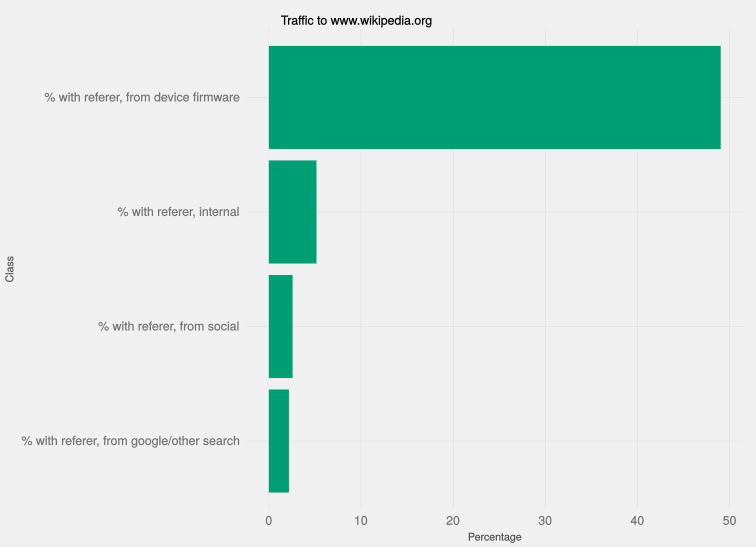
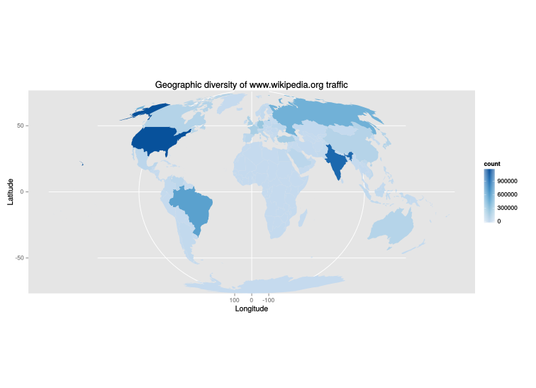

This report describes some exploratory research done on the Wikipedia portal (www.wikipedia.org) to understand how readers use it and recommend what we might do to improve it, or gain a more fine-grained understanding of its use.

In general we found that a surprisingly large chunk of the traffic to Wikipedia as a whole passes through this portal - and that much of that comes from geographic areas we know we need to target for our projects' readership to grow. We recommend further data-gathering through more detailed EventLogging schemas, and some quick fixes to drastically improve the experience for mobile users.

## Background
The [Wikipedia portal](https://www.wikipedia.org) is the landing page for the Wikipedia class of projects; readers who land there are directed to the various language versions' main pages, and presented with a search box to hunt for specific content more directly.

Despite its prominence structurally, we have almost no insight into the use of the portal: it has never been anyone's responsibility. The Discovery team, which has a strong interest in and responsibility for search and how people get to and consume our content, now *has* responsibility for the portals. Accordingly we did some basic, exploratory work to understand our traffic from and to the portals, targeting the Wikipedia one due to the scale and diversity of traffic Wikipedia tends to receive.

Due to the lack of investment of time and effort the only logs of portal usage are the Wikimedia access logs, which contain raw data about HTTP and HTTPS requests to all of our pages. We retrieved traffic from 5 unique hours and days between 19 and 26 April 2015, and based our analysis on that data.

## Analysis

### Scale

The 5 hours of log contained 3.5 million events - almost all of which would be considered pageviews if they had happened on a MediaWiki-based project. Scaled out, this comes to 185 million requests a week - which, for context, would mean that if we counted portal pageviews as pageviews, our global pageviews count would instantaneously increase 4%.

Such a massive amount of traffic was deeply surprising to the Discovery team, and, we suspect, will be surprising for a lot of users - from an editors' perspective the portal is, at best, secondary. The traffic that it gets is a strong argument for dedicating more research and software development effort to it.

### Source

One interesting way of understanding and aggregating incoming traffic is by referer; looking at where users' came from to visit the portal.

Of particular interest to the Foundation is traffic from social media or from search engines; also of interest is internal traffic (from other Wikimedia sites) and traffic due to device firmware. Accordingly we tried to split out and look specifically at traffic from those sources.

This shows that the vast majority of traffic to the portal is via device firmware - people whose machines (usually phones, and usually older phones at that) are designed to point them towards the portal. This is particularly concerning because the mobile version of the portal is practically non-existent.

Internal traffic, social media traffic, and search traffic are all present, but a much smaller slice of the pie.

### Geographic diversity

*Where* the traffic comes from is also interesting - do portal visitors look like our normal audience or not? Are the people visiting the portal from the countries we already have extensive penetration in, or the countries we're looking to branch out into?

Traffic to the Portal is far more commonly from the nations that are our (theoretical) growth areas: places where people are coming on to the internet for the first time, such as India and Brazil. This means that not only does the portal represent a vast source of traffic, it represents a vast source of traffic from the places we're particularly interested in growing in.

## Conclusion and further work

Based on this we should put effort into gathering more data about how the portal is used, particularly what features or class of link people tend to use, how their behaviour once they land on Wikipedia differs from the behaviour of 'directly-sourced' users, and what the mobile/desktop difference looks like. From this we can begin working on features to A/B test that would increase the users' clickthrough rate.

At the same time there is some low-hanging fruit - particularly of note is that requests to mobile are automatically passed through to the English-language Wikipedia's main page, regardless of the user's language or location - that we can work on fixing immediately, and should.